# stock-data-pipeline

This project implements an end-to-end data pipeline that retrieves daily stock market data from the Alpha Vantage API, transforms it using Python, stores it in a PostgreSQL database hosted on AWS RDS, and visualizes key financial metrics using Grafana. The entire workflow is orchestrated and automated with Apache Airflow.

## Architecture Diagram

```mermaid
flowchart TB

    %% Data Acquisition
    subgraph DA["𝐃𝐚𝐭𝐚 𝐀𝐜𝐪𝐮𝐢𝐬𝐢𝐭𝐢𝐨𝐧"]
        direction TB
        API["𝐀𝐥𝐩𝐡𝐚 𝐕𝐚𝐧𝐭𝐚𝐠𝐞 𝐀𝐏𝐈"]
        FSD["𝐅𝐞𝐭𝐜𝐡_𝐬𝐭𝐨𝐜𝐤_𝐝𝐚𝐭𝐚.𝐩𝐲"]
        ENV[".𝐞𝐧𝐯 𝐟𝐢𝐥𝐞"]
    end

    %% Data Transformation
    subgraph DT["𝐃𝐚𝐭𝐚 𝐓𝐫𝐚𝐧𝐬𝐟𝐨𝐫𝐦𝐚𝐭𝐢𝐨𝐧"]
        direction TB
        CAT["𝐜𝐥𝐞𝐚𝐧_𝐚𝐧𝐝_𝐭𝐫𝐚𝐧𝐬𝐟𝐨𝐫𝐦_𝐝𝐚𝐭𝐚.𝐩𝐲"]
    end

    %% Data Storage
    subgraph DS["𝐃𝐚𝐭𝐚 𝐒𝐭𝐨𝐫𝐚𝐠𝐞"]
        direction TB
        AWS["𝐀𝐖𝐒 𝐑𝐃𝐒 𝐏𝐨𝐬𝐭𝐠𝐫𝐞𝐒𝐐𝐋"]
        T1["𝐝𝐚𝐢𝐥𝐲_𝐬𝐭𝐨𝐜𝐤_𝐝𝐚𝐭𝐚"]
        T2["𝐭𝐫𝐚𝐧𝐬𝐟𝐨𝐫𝐦𝐞𝐝_𝐬𝐭𝐨𝐜𝐤_𝐝𝐚𝐭𝐚"]
        PG["𝐩𝐠𝐀𝐝𝐦𝐢𝐧"]
    end

    %% Orchestration
    subgraph ORC["𝐎𝐫𝐜𝐡𝐞𝐬𝐭𝐫𝐚𝐭𝐢𝐨𝐧"]
        direction TB
        AF["𝐀𝐩𝐚𝐜𝐡𝐞 𝐀𝐢𝐫𝐟𝐥𝐨𝐰"]
        DAG["𝐬𝐭𝐨𝐜𝐤_𝐝𝐚𝐭𝐚_𝐩𝐢𝐩𝐞𝐥𝐢𝐧𝐞_𝐝𝐚𝐠.𝐩𝐲"]
        FT["𝐟𝐞𝐭𝐜𝐡_𝐬𝐭𝐨𝐜𝐤_𝐝𝐚𝐭𝐚_𝐭𝐚𝐬𝐤"]
        TT["𝐭𝐫𝐚𝐧𝐬𝐟𝐨𝐫𝐦_𝐚𝐧𝐝_𝐥𝐨𝐚𝐝_𝐭𝐚𝐬𝐤"]
    end

    %% Visualization
    subgraph VIS["𝐕𝐢𝐬𝐮𝐚𝐥𝐢𝐳𝐚𝐭𝐢𝐨𝐧"]
        direction TB
        GF["𝐆𝐫𝐚𝐟𝐚𝐧𝐚 𝐝𝐚𝐬𝐡𝐛𝐨𝐚𝐫𝐝𝐬"]
        GFDB["𝐏𝐨𝐬𝐭𝐠𝐫𝐞𝐒𝐐𝐋 (𝐬𝐭𝐨𝐜𝐤_𝐝𝐚𝐭𝐚_𝐝𝐛)"]
    end

    %% Connections
    API --> FSD
    FSD --> T1
    ENV --- FSD

    T1 --> CAT
    CAT --> T2

    AWS --- PG

    T2 --- GFDB
    GFDB --> GF

    AF --> DAG
    DAG --> FT
    DAG --> TT
    FT --> FSD
    TT --> CAT

    %% Styling
    style API fill:#f9f,stroke:#333,stroke-width:2px,color:#333
    style FSD fill:#bbf,stroke:#333,stroke-width:2px,color:#333
    style ENV fill:#ddd,stroke:#333,stroke-width:1px,color:#333
    style CAT fill:#bbf,stroke:#333,stroke-width:2px,color:#333
    style AWS fill:#9f9,stroke:#333,stroke-width:2px,color:#333
    style T1 fill:#cde,stroke:#333,stroke-width:1px,color:#333
    style T2 fill:#cde,stroke:#333,stroke-width:1px,color:#333
    style PG fill:#e6e6fa,stroke:#333,stroke-width:1px,color:#333
    style AF fill:#f8d568,stroke:#333,stroke-width:2px,color:#333
    style DAG fill:#f8d568,stroke:#333,stroke-width:1px,color:#333,stroke-dasharray: 5 5
    style FT fill:#f8d568,stroke:#333,stroke-width:1px,color:#333
    style TT fill:#f8d568,stroke:#333,stroke-width:1px,color:#333
    style GF fill:#ffb366,stroke:#333,stroke-width:2px,color:#333
    style GFDB fill:#ffcc99,stroke:#333,stroke-width:1px,color:#333

```



## Project Overview

The primary goal of this project is to build an automated system for collecting, processing, storing, and analyzing stock market data for multiple symbols. This allows for tracking price trends, moving averages, and other potential Key Performance Indicators (KPIs).

### Key Features:

1. **Data Fetching:** Fetches daily time series data (closing price, open, high, low, volume) for user-specified stock symbols (e.g., IBM, AAPL, MSFT) from the Alpha Vantage API.
2. **Data Transformation:** Calculates key metrics such as the 20-day Moving Average (MA) and daily percentage change for fetched stock data.
3. **Data Storage:** Stores both raw and transformed stock data in a PostgreSQL database hosted on **AWS RDS**.
4. **Orchestration:** An **Apache Airflow DAG (`stock_data_pipeline`)** manages the data fetching, transformation, and loading tasks, allowing for parameterized runs (by stock symbol) and configured retries.
5. **Data Visualization:** A **Grafana dashboard** connects to the AWS RDS database to display interactive charts, currently showing closing prices and 20-day moving averages for selected stocks.

## Technologies Used

- **Python 3**
- **Pandas**
- **Requests**
- **Psycopg2**
- **python-dotenv**
- **PostgreSQL**
- **AWS RDS**
- **Apache Airflow**
- **Grafana**
- **Git & GitHub**

## Project Structure

```
stock-data-pipeline/
├── .env
├── .gitignore
├── dags/
│   └── stock_data_pipeline_dag.py
├── Workspace_stock_data.py
├── clean_and_transform_data.py
├── Workspace_and_analyze_stockdata.py
├── grafana_dashboards/
│   └── dashboard_export.json (optional)
├── images/
│   └──screenshot.png
└── README.md
```

## Setup and Installation

### 1. Clone the Repository

```bash
git clone https://github.com/YOUR_USERNAME/stock-data-pipeline.git
cd stock-data-pipeline
```

### 2. Create Virtual Environment and Install Dependencies

```bash
python3 -m venv venv
source venv/bin/activate
pip install pandas requests psycopg2-binary python-dotenv argparse
```

### 3. AWS RDS PostgreSQL Setup

- Create an RDS PostgreSQL instance.
- Ensure it's publicly accessible and port 5432 is open.
- Create a database (e.g., `stock_data_db`).

Example SQL for table setup:

```sql
-- Raw data table
CREATE TABLE IF NOT EXISTS daily_stock_data (
    id SERIAL PRIMARY KEY,
    symbol VARCHAR(10) NOT NULL,
    trade_date DATE NOT NULL,
    open_price NUMERIC(10, 2),
    high_price NUMERIC(10, 2),
    low_price NUMERIC(10, 2),
    close_price NUMERIC(10, 2),
    volume BIGINT,
    fetched_at TIMESTAMP DEFAULT CURRENT_TIMESTAMP,
    UNIQUE (symbol, trade_date)
);

-- Transformed data table
CREATE TABLE IF NOT EXISTS transformed_stock_data (
    id SERIAL PRIMARY KEY,
    symbol VARCHAR(10) NOT NULL,
    trade_date DATE NOT NULL,
    open_price NUMERIC(10,2),
    high_price NUMERIC(10,2),
    low_price NUMERIC(10,2),
    close_price NUMERIC(10,2),
    volume BIGINT,
    ma_20_day NUMERIC(10,2),
    daily_pct_change NUMERIC(10,4),
    transformed_at TIMESTAMP DEFAULT CURRENT_TIMESTAMP,
    UNIQUE (symbol, trade_date)
);
```

### 4. Create `.env` File

```env
ALPHA_VANTAGE_API_KEY="your_api_key"
DB_HOST="your-db-host.rds.amazonaws.com"
DB_NAME="stock_data_db"
DB_USER="your_db_username"
DB_PASSWORD_POSTGRES="your_db_password"
```

Ensure `.env` is in your `.gitignore`.

### 5. Set Up Apache Airflow

- Install Airflow in a separate virtual environment.
- Run:

```bash
pip install apache-airflow
airflow db migrate
```

- Put your DAG file in `~/airflow/dags` or link it:

```bash
ln -s /path/to/stock-data-pipeline/dags/stock_data_pipeline_dag.py ~/airflow/dags/
```

### 6. Set Up Grafana

- Install Grafana (e.g., via Homebrew or official package).
- Start Grafana: `brew services start grafana`
- Visit: [http://localhost:3000](http://localhost:3000)
- Add your PostgreSQL RDS as a data source.

## Running the Pipeline

### 1. Start Airflow

```bash
source ~/airflow_venv/bin/activate
airflow standalone
```

- Open Airflow UI at `http://localhost:8080`
- Unpause and trigger the `stock_data_pipeline` DAG.

### 2. Open Grafana Dashboard

- Go to `http://localhost:3000`
- View your dashboard (e.g., "Stock Price Dashboard")

## Dashboard Preview


(Optional: Import `grafana_dashboards/dashboard_export.json` in Grafana to reproduce this layout.)

## Current Status

- End-to-end pipeline: fetch → transform → store
- Orchestration with Apache Airflow
- Visualization with Grafana
- Secrets managed with `.env`

## Read the Full Walkthrough

I wrote a short article describing how I built this project and why I made certain decisions.

👉 [How I Built a Stock Data Pipeline](https://liinda.hashnode.dev/how-i-built-a-stock-data-pipeline)


## Next Steps

- Add more KPIs (e.g., % change, volume trends)
- Data validation & anomaly detection
- Notifications on DAG failure
- Modularize ETL scripts
- Deploy to the cloud (e.g., EC2, ECS, or Lambda + Step Functions)
